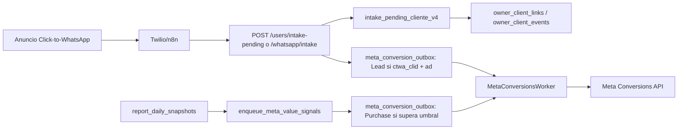
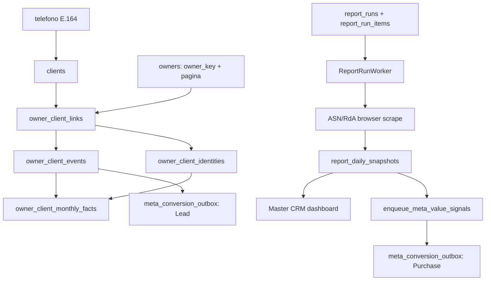

# Master CRM RL: auditoria Landing Page, Pixel y CAPI

Fecha de corte: 2026-05-29

## Resumen ejecutivo

Master CRM RL hoy esta armado como backend operacional y CRM owner-centric, no como landing page. La integracion Meta existente es principalmente para Click-to-WhatsApp: entra un lead por WhatsApp/Twilio, se persiste el telefono en Supabase, se encola `Lead` si hay `ctwa_clid` atribuible, y luego se encola `Purchase` si el cliente alcanza el umbral de carga configurado. Ese flujo es razonable para CTWA, pero no cubre todavia el caso de una landing web con Pixel de navegador mas CAPI server-side deduplicada.

Para una landing rentable, el objetivo no deberia ser "solo medir visitas". El objetivo correcto es construir una cadena de senales limpia:

1. `PageView` y `ViewContent` desde Pixel al cargar la landing.
2. `Lead` cuando el usuario envia el formulario o toca WhatsApp con identificacion suficiente.
3. `CompleteRegistration` o evento equivalente cuando se crea/asigna el usuario en el panel.
4. `Purchase` o senal de valor cuando el cliente carga dinero real, con `value` y `currency`.

La diferencia clave contra el estado actual es que una landing web debe capturar y preservar `_fbp`, `_fbc`, `fbclid`, IP, user-agent, URL, UTM y consentimiento. Esos datos deben entrar al backend junto con el telefono y el owner asignado. Hoy el repo tiene estructura para CAPI, outbox, deduplicacion por `event_id` y auditoria, pero no tiene endpoint ni modelo especifico para landing web.

## Evidencia del repo

### Componentes actuales

- `src/server.ts`: expone endpoints Master CRM, intake, WhatsApp, assign-phone y arranca `MetaConversionsWorker`.
- `src/player-phone-store.ts`: persiste telefonos, owner/client links, intake pending y asignacion de username.
- `src/mastercrm-user-store.ts`: dashboard del cajero desde `owner_client_monthly_facts`, snapshots y financials.
- `src/meta-source-context.ts`: normaliza metadata CTWA, incluyendo `ctwaClid`, IP y user-agent.
- `src/meta-conversions-store.ts`: encola eventos Meta en `meta_conversion_outbox`.
- `src/meta-conversions.ts`: arma payload CAPI y envia a `/{dataset_id}/events`.
- `src/meta-conversions-worker.ts`: worker con scan, lease, retry y marcado `sent/failed`.
- `db/migrations/20260326_meta_ctwa_v3_lead_purchase.sql`: crea la logica `enqueue_meta_value_signals(...)` para calificar `Purchase`.
- `docs/README_META_CAPI_CTWA.md`: documenta el flujo CTWA actual y el dataset activo.

### Flujo actual real



### Mapa funcional Master CRM RL

El repo opera con un modelo owner-centric. La entidad central no es el usuario global sino la relacion `owner + client`.



Roles de cada parte:

- `owners`: define cajero/owner real por `owner_key`, `owner_label` y `pagina`. Este punto es critico porque un mismo label puede existir en ASN y RdA.
- `clients`: contacto global por telefono.
- `owner_client_links`: cartera real de un owner sobre un telefono, con estado `pending` o `assigned`.
- `owner_client_identities`: username activo/historico del telefono dentro de ese owner.
- `owner_client_events`: bitacora de negocio; de aca salen intakes, asignaciones y reingresos.
- `owner_client_monthly_facts`: snapshot mensual calculado por `refresh_owner_client_monthly_facts_v1(...)`; alimenta el dashboard web.
- `report_runs` y `report_run_items`: cola persistida de corrida masiva diaria.
- `report_daily_snapshots`: resultado economico por username/owner/dia; alimenta KPIs y `Purchase` CAPI.
- `meta_conversion_outbox`: cola auditable hacia Meta.

Puntos de codigo relevantes:

- `src/server.ts`: rutas publicas y arranque de workers.
- `src/player-phone-store.ts`: `intakePendingCliente(...)` crea/actualiza telefono, owner link, evento y refresca facts mensuales.
- `src/mastercrm-user-store.ts`: `getClientsDashboard(...)` lee facts mensuales y snapshots para el panel.
- `src/report-run-store.ts`: `upsertDailySnapshot(...)` escribe las cargas diarias.
- `src/report-worker.ts`: ejecuta items de reporte y actualiza snapshot/run status.
- `src/meta-conversions-store.ts`: encola/leasea/persiste estado de eventos Meta.
- `src/meta-conversions.ts`: arma el payload final hacia Graph API.

### Implicancia para landing

La landing no debe crear una base paralela de leads. Debe entrar por la misma puerta de negocio que WhatsApp:

1. Normalizar telefono.
2. Resolver owner/pagina.
3. Crear `owner_client_link` en `pending`.
4. Registrar evento `intake`.
5. Refrescar `owner_client_monthly_facts`.
6. Encolar `Lead` CAPI web.
7. Dejar que la corrida diaria detecte valor real y encole `Purchase`.

Si la landing saltea `owner_client_events` o `refresh_owner_client_monthly_facts_v1(...)`, el panel puede no mostrar el lead mensual aunque CAPI lo haya recibido. Si saltea `report_daily_snapshots`, Meta no aprende de valor real.

### Lo que ya esta bien encaminado

- Tiene outbox transaccional para no depender de llamadas sincrona a Meta.
- Tiene retry, leasing y auditoria (`request_payload`, `response_body`, `fbtrace_id`).
- Usa `event_id` estable para deduplicar internamente.
- Envia `ph` hasheado y `external_id`.
- Usa `ctwa_clid` para atribucion CTWA cuando existe.
- Envia `Purchase` con `value` real (`first_day_cargado_hoy`) y `currency`.
- Evita inventar `_fbp` o `_fbc` cuando el flujo no es web.

### Gaps para landing page

1. No hay codigo de landing page en el repo. No aparecen archivos frontend, rutas estaticas, componentes ni tracking web nativo.
2. No hay endpoint especifico tipo `POST /landing/lead` o `POST /events/landing` para recibir datos de Pixel/browser.
3. El payload CAPI actual no envia `client_ip_address`, `client_user_agent`, `fbp` ni `fbc`. Para CTWA puede ser aceptable; para landing web es una perdida fuerte de match quality.
4. No hay persistencia de `landing_session_id`, `event_id` browser/server, `fbclid`, `_fbp`, `_fbc`, UTM, pagina de destino, referrer ni consentimiento.
5. No hay deduplicacion Pixel+CAPI web. El repo deduplica internamente por outbox, pero falta el contrato browser/server: mismo `event_name` + mismo `event_id`.
6. `META_ACTION_SOURCE` esta validado en produccion como `system_generated`. Para landing web, los eventos web deberian salir como `action_source = website`.
7. El evento `Lead` actual depende de `ReferralSourceType = ad` y `ctwaClid`. Una landing debe admitir attribution web mediante `fbclid/_fbc`, aun si no hay `ctwa_clid`.
8. No hay control de calidad operativo: no existe reporte automatico de `Event Match Quality`, tasa de `sent`, errores CAPI, eventos duplicados, `fbtrace_id` ni diferencia Pixel vs CAPI.

## Criterio tecnico para una landing rentable

Una landing que mejore rentabilidad tiene que hacer dos cosas a la vez:

1. Convertir mas visitantes: claridad, velocidad, confianza, baja friccion y CTA obvio.
2. Alimentar mejor el algoritmo: eventos de mayor calidad, deduplicados, con identidad suficiente y valor real.

Si se optimiza solo el diseno sin mejorar tracking, Meta aprende lento o aprende mal. Si se manda CAPI sin buena experiencia de landing, el algoritmo recibe senales pero el embudo pierde usuarios antes del lead.

## Landing page recomendada

### Estructura de pagina

La landing deberia ser de una sola decision: dejar telefono o iniciar WhatsApp. No conviene meter muchas rutas ni opciones.

Secciones recomendadas:

1. Hero con promesa concreta y CTA arriba del fold.
2. Prueba/confianza: beneficios, seguridad, tiempos de respuesta, soporte real.
3. Como funciona en 3 pasos.
4. Formulario corto: telefono obligatorio, nombre opcional, preferencia ASN/RdA si aplica.
5. CTA WhatsApp alternativo con parametros preservados.
6. Preguntas frecuentes: retiro/carga, soporte, privacidad, tiempos.
7. Footer con politica de privacidad y consentimiento.

### Reglas de conversion

- Mobile-first. La mayoria del trafico Meta va a abrir desde app movil.
- Carga inicial menor a 2 segundos si es posible.
- CTA unico y persistente.
- Formulario de un campo principal: telefono.
- Validacion E.164 o normalizacion Argentina robusta.
- Mensaje de confirmacion inmediato.
- Fallback a WhatsApp si falla el formulario.
- No pedir registro completo antes del contacto inicial.

### Datos que debe capturar

Campos tecnicos:

- `landing_session_id`: UUID generado en primer page load.
- `event_id`: UUID por evento importante.
- `fbclid`: query param.
- `_fbc`: cookie derivada de `fbclid` si existe.
- `_fbp`: cookie de browser.
- `client_user_agent`.
- `client_ip_address`: capturado server-side, no confiando en JS.
- `event_source_url`.
- `referrer`.
- `utm_source`, `utm_medium`, `utm_campaign`, `utm_content`, `utm_term`.
- `ad_id`, `adset_id`, `campaign_id` si llegan por UTMs o macros.
- `consent_marketing`, `consent_timestamp`.

Campos de negocio:

- `telefono`.
- `owner_key` elegido por regla de asignacion.
- `owner_label`.
- `pagina`: `ASN` o `RdA`.
- `lead_source = landing`.
- `landing_variant`.
- `cta_type`: `form_submit` o `whatsapp_click`.

## Pixel + CAPI recomendado

### Eventos

| Momento | Pixel navegador | CAPI backend | Notas |
|---|---|---|---|
| Carga landing | `PageView` | opcional | Pixel basta salvo medicion estricta server-side. |
| Vista relevante | `ViewContent` | opcional | Usar si hay secciones/variantes medibles. |
| Submit telefono | `Lead` | `Lead` | Debe usar mismo `event_id` para deduplicar. |
| Click WhatsApp | `Contact` o `Lead` | `Lead` si hay telefono o contexto suficiente | Evitar inflar leads sin contacto real. |
| Alta/asignacion usuario | `CompleteRegistration` opcional | `CompleteRegistration` | Mejor senal intermedia que solo Lead. |
| Carga >= umbral | no aplica | `Purchase` | Debe venir del CRM/reportes, como ya existe. |

### Deduplicacion

Para eventos enviados por Pixel y CAPI:

- El browser genera `event_id`.
- El Pixel dispara `fbq('track', 'Lead', params, {eventID: eventId})`.
- El formulario manda el mismo `event_id` al backend.
- El backend encola CAPI con ese mismo `event_id`.
- Meta deduplica por `event_name` + `event_id`.

Esto no existe hoy para landing. El `event_id` actual se genera server-side como hash estable por owner/client/ctwa. Sirve para CTWA, pero no alcanza para deduplicar Pixel+CAPI web.

### User data para Event Match Quality

Para landing web, el CAPI deberia enviar:

- `ph`: telefono hasheado, normalizado a solo digitos.
- `external_id`: id estable hasheado del cliente o owner/client.
- `fbp`: cookie `_fbp`.
- `fbc`: cookie `_fbc` o derivada de `fbclid`.
- `client_ip_address`: desde request.
- `client_user_agent`: desde header.
- `country`, `ct`, `st`, `zp` solo si se capturan de forma confiable.

Hoy el repo envia `ph`, `external_id` y `ctwa_clid`, pero no `fbp/fbc/IP/UA` en el payload final. `meta-source-context.ts` ya acepta IP/UA, asi que el modelo esta cerca, pero `buildMetaConversionsRequestBody(...)` los omite.

### Action source

- CTWA actual: puede seguir con `system_generated`, porque el evento nace del CRM y WhatsApp.
- Landing web: usar `website`.
- WhatsApp business messaging: solo si se decide implementar correctamente `business_messaging`, con `messaging_channel` y Page/WABA ID. El repo ya detecto rechazos previos de Meta para `business_messaging`; no conviene reactivarlo sin pruebas.

## Diseno de integracion propuesto

### Nuevo endpoint

Agregar:

`POST /landing/lead`

Payload sugerido:

```json
{
  "pagina": "RdA",
  "telefono": "+5493516326134",
  "ownerContext": {
    "ownerKey": "luqui10:vicky",
    "ownerLabel": "Vicky",
    "actorAlias": "landing",
    "actorPhone": null
  },
  "landingContext": {
    "landingSessionId": "uuid",
    "eventId": "uuid",
    "eventSourceUrl": "https://...",
    "referrer": "https://facebook.com/...",
    "fbp": "fb.1....",
    "fbc": "fb.1....",
    "fbclid": "...",
    "utmSource": "facebook",
    "utmMedium": "paid_social",
    "utmCampaign": "...",
    "utmContent": "...",
    "landingVariant": "v1",
    "ctaType": "form_submit",
    "consentMarketing": true
  }
}
```

El endpoint deberia:

1. Normalizar telefono.
2. Resolver/validar owner.
3. Persistir intake como hoy con `intake_pending_cliente_v4`.
4. Persistir evento `landing_lead` con contexto web completo.
5. Encolar `Lead` CAPI con `action_source = website`, `event_id` recibido y user_data web.
6. Responder al frontend con estado y proximo paso.

### Contrato exacto de landing

Request recomendado:

```json
{
  "pagina": "RdA",
  "telefono": "+5493516326134",
  "ownerContext": {
    "ownerKey": "luqui10:vicky",
    "ownerLabel": "Vicky",
    "actorAlias": "landing",
    "actorPhone": null
  },
  "landingContext": {
    "landingSessionId": "9a6ff9f6-bd38-41ea-91ec-52230262a2df",
    "eventId": "lead_9a6ff9f6_1717000000000",
    "eventSourceUrl": "https://landing.mastercrmrl.com/?fbclid=...",
    "referrer": "https://l.facebook.com/",
    "fbp": "fb.1.1717000000000.1234567890",
    "fbc": "fb.1.1717000000000.AbCdEf",
    "fbclid": "AbCdEf",
    "utmSource": "facebook",
    "utmMedium": "paid_social",
    "utmCampaign": "rda_mayo_value",
    "utmContent": "creative_01",
    "utmTerm": null,
    "landingVariant": "v1",
    "ctaType": "form_submit",
    "consentMarketing": true,
    "consentTimestamp": "2026-05-29T15:00:00.000Z"
  }
}
```

Response recomendado:

```json
{
  "status": "ok",
  "pagina": "RdA",
  "telefono": "+5493516326134",
  "ownerContext": {
    "ownerKey": "luqui10:vicky",
    "ownerLabel": "Vicky"
  },
  "leadEventId": "lead_9a6ff9f6_1717000000000",
  "linkId": "uuid",
  "estado": "pending"
}
```

Validaciones:

- `pagina` solo `ASN` o `RdA`.
- `telefono` obligatorio y normalizable a E.164.
- `ownerContext.ownerKey` obligatorio en fase 1; si luego se automatiza asignacion, el backend debe resolverlo antes de persistir.
- `landingContext.eventId` obligatorio para deduplicacion.
- `landingContext.eventSourceUrl` obligatorio para eventos website.
- `consentMarketing = true` requerido antes de enviar Pixel/CAPI con parametros de marketing.
- IP y user-agent se toman del request real, no del JSON del browser.

### Snippet browser recomendado

Este snippet es orientativo; el frontend real debe adaptarlo al framework elegido.

```html
<script>
  !(function(f,b,e,v,n,t,s){
    if(f.fbq)return;n=f.fbq=function(){n.callMethod?
    n.callMethod.apply(n,arguments):n.queue.push(arguments)};
    if(!f._fbq)f._fbq=n;n.push=n;n.loaded=!0;n.version='2.0';
    n.queue=[];t=b.createElement(e);t.async=!0;
    t.src=v;s=b.getElementsByTagName(e)[0];
    s.parentNode.insertBefore(t,s)
  })(window, document, 'script', 'https://connect.facebook.net/en_US/fbevents.js');

  fbq('init', 'META_PIXEL_ID');
  fbq('track', 'PageView');
</script>
```

```js
function readCookie(name) {
  return document.cookie
    .split('; ')
    .find((row) => row.startsWith(`${name}=`))
    ?.split('=')
    .slice(1)
    .join('=') || null;
}

function buildFbcFromFbclid() {
  const fbclid = new URLSearchParams(window.location.search).get('fbclid');
  if (!fbclid) return readCookie('_fbc');
  return `fb.1.${Date.now()}.${fbclid}`;
}

async function submitLead({ telefono, ownerContext, pagina }) {
  const eventId = `lead_${crypto.randomUUID()}`;
  const fbp = readCookie('_fbp');
  const fbc = buildFbcFromFbclid();
  const params = new URLSearchParams(window.location.search);

  fbq('track', 'Lead', {
    content_name: 'landing_lead',
    lead_source: 'landing'
  }, { eventID: eventId });

  const response = await fetch('https://apiscrap.mastercrmrl.com/landing/lead', {
    method: 'POST',
    headers: { 'Content-Type': 'application/json' },
    body: JSON.stringify({
      pagina,
      telefono,
      ownerContext,
      landingContext: {
        landingSessionId: localStorage.getItem('landing_session_id') || crypto.randomUUID(),
        eventId,
        eventSourceUrl: window.location.href,
        referrer: document.referrer || null,
        fbp,
        fbc,
        fbclid: params.get('fbclid'),
        utmSource: params.get('utm_source'),
        utmMedium: params.get('utm_medium'),
        utmCampaign: params.get('utm_campaign'),
        utmContent: params.get('utm_content'),
        utmTerm: params.get('utm_term'),
        landingVariant: 'v1',
        ctaType: 'form_submit',
        consentMarketing: true,
        consentTimestamp: new Date().toISOString()
      }
    })
  });

  if (!response.ok) {
    throw new Error('No se pudo registrar el lead');
  }

  return response.json();
}
```

Punto critico: si el Pixel dispara `Lead` con `eventID = A`, CAPI debe enviar `event_id = A`. Si CAPI inventa otro ID, Meta puede contar doble o no deduplicar.

### Nueva persistencia

Opcion minima:

- Extender `owner_client_events.payload` para guardar `landingContext`.

Opcion robusta:

- Crear `landing_sessions`.
- Crear `landing_events`.
- Relacionar con `owner_id`, `client_id`, `link_id`.

Modelo recomendado:

```sql
landing_sessions(
  id uuid primary key,
  first_seen_at timestamptz not null,
  last_seen_at timestamptz not null,
  fbp text null,
  fbc text null,
  fbclid text null,
  landing_url text not null,
  referrer text null,
  utm_source text null,
  utm_medium text null,
  utm_campaign text null,
  utm_content text null,
  utm_term text null,
  landing_variant text null,
  consent_marketing boolean null
)
```

```sql
landing_events(
  id uuid primary key,
  landing_session_id uuid references landing_sessions(id),
  owner_id uuid null,
  client_id uuid null,
  event_name text not null,
  event_id text not null,
  event_time timestamptz not null,
  phone_e164 text null,
  action_source text not null default 'website',
  source_payload jsonb not null default '{}',
  created_at timestamptz not null default now()
)
```

### Cambios CAPI

Cambios necesarios:

1. Ampliar `MetaConversionStage` con `landing_lead` o reusar `lead` con `source = landing`.
2. Permitir `event_id` externo para eventos web.
3. Permitir `action_source` por evento, no solo global por env.
4. Enviar `fbp`, `fbc`, `client_ip_address`, `client_user_agent` cuando existan.
5. Diferenciar CTWA y landing en `custom_data.lead_event_source`.
6. Mantener `Purchase` server-side con valor real del CRM.

Implementacion minima en codigo:

- `src/types.ts`: agregar `LandingContext`.
- `src/meta-source-context.ts`: extender payload con `fbp`, `fbc`, `fbclid`, UTM, landing session y event source URL.
- `src/meta-conversions-store.ts`: agregar `enqueueLandingLead(...)` o extender `enqueueLead(...)` con `eventId` externo y `actionSource`.
- `src/meta-conversions.ts`: aceptar `action_source = website` y serializar `fbp`, `fbc`, `client_ip_address`, `client_user_agent`.
- `src/server.ts`: agregar schema Zod y ruta `POST /landing/lead`.
- `tests/meta-conversions.test.ts`: cubrir payload web con `fbp/fbc/IP/UA` y dedupe event id.
- `tests/server.test.ts`: cubrir que `/landing/lead` persiste intake y encola CAPI cuando hay consentimiento.
- `db/migrations`: opcion robusta con `landing_sessions` y `landing_events`; opcion minima usando `owner_client_events.payload`.

### Compatibilidad con lo existente

No hay que romper CTWA. El flujo actual debe quedar igual:

- CTWA sigue usando `ctwa_clid`.
- Landing usa `_fbp/_fbc/fbclid`.
- Ambos terminan en `owner_client_links`.
- Ambos pueden alimentar `Purchase` desde `report_daily_snapshots`.

La mejora es que el cliente que entra por landing conserva mejor identidad web para Meta.

## Inventario operativo del backend

### Endpoints actuales

El servidor actual no tiene endpoint landing. Estos son los endpoints relevantes que ya existen:

| Endpoint | Uso actual | Relevancia para landing/CAPI |
|---|---|---|
| `POST /mastercrm-register` | Alta usuario web CRM | No participa en tracking de leads. |
| `POST /mastercrm-login` | Login CRM | No participa en tracking de leads. |
| `POST /mastercrm-clients` | Dashboard del cajero | Debe mostrar leads landing si entran por monthly facts. |
| `POST /mastercrm-owner-financials` | Inversion/comision mensual | Puede usarse para ROI por owner. |
| `POST /mastercrm-link-cashier` | Vincula usuario web con owner | Critico para no mezclar ASN/RdA. |
| `POST /users/create-player` | Crea usuario en panel ASN/RdA | Puede convertirse en `CompleteRegistration`. |
| `POST /users/intake-pending` | Crea lead pendiente por telefono | Base reutilizable para landing. |
| `POST /whatsapp/intake` | Intake simplificado Twilio/n8n | Base CTWA actual. |
| `POST /users/assign-phone` | Asigna username a telefono | Puede disparar `CompleteRegistration` server-side. |
| `POST /users/unassign-phone` | Desasigna username | No enviar eventos Meta. |
| `POST /users/deposit` | Operaciones de carga/descarga | No usar para CAPI si no confirma valor real. |
| `POST /reports/run` | Corrida masiva generica | Alimenta snapshots para valor. |
| `POST /reports/asn/run` | Corrida ASN | Alimenta snapshots ASN. |
| `POST /reports/rda/run` | Corrida RdA | Alimenta snapshots RdA. |
| `GET /reports/*/items` | Detalle corrida | QA operacional. |

Endpoint nuevo recomendado:

| Endpoint | Uso | Por que no reusar directamente `/users/intake-pending` |
|---|---|---|
| `POST /landing/lead` | Intake web + tracking Pixel/CAPI | Evita mezclar CTWA con landing, permite validar consentimiento, `event_id`, `_fbp/_fbc`, UTMs, IP/UA y `action_source = website`. |

### Variables actuales

Variables existentes relevantes:

- `SUPABASE_URL`
- `SUPABASE_SERVICE_ROLE_KEY`
- `MASTERCRM_STAFF_LINK_PASSWORD`
- `MASTERCRM_CORS_ORIGINS`
- `REPORT_WORKER_ENABLED`
- `REPORT_WORKER_CONCURRENCY`
- `REPORT_WORKER_POLL_MS`
- `REPORT_WORKER_LEASE_SECONDS`
- `REPORT_WORKER_MAX_ATTEMPTS`
- `META_ENABLED`
- `META_DATASET_ID`
- `META_ACCESS_TOKEN`
- `META_API_VERSION`
- `META_ACTION_SOURCE`
- `META_LEAD_ENABLED`
- `META_PURCHASE_ENABLED`
- `META_VALUE_SIGNAL_THRESHOLD`
- `META_VALUE_SIGNAL_CURRENCY`
- `META_VALUE_SIGNAL_WINDOW_MODE`
- `META_BATCH_SIZE`
- `META_WORKER_CONCURRENCY`
- `META_WORKER_POLL_MS`
- `META_WORKER_LEASE_SECONDS`
- `META_WORKER_MAX_ATTEMPTS`
- `META_WORKER_SCAN_LIMIT`
- `META_TEST_EVENT_CODE`

Variables nuevas recomendadas para landing:

- `LANDING_ENABLED=true`
- `LANDING_ALLOWED_ORIGINS=https://landing.mastercrmrl.com`
- `LANDING_DEFAULT_PAGINA=RdA`
- `LANDING_DEFAULT_OWNER_KEY=luqui10:luqui10`
- `LANDING_REQUIRE_MARKETING_CONSENT=true`
- `META_PIXEL_ID=2123208205169806` o el pixel/dataset correspondiente
- `META_LANDING_ACTION_SOURCE=website`

No conviene cambiar globalmente `META_ACTION_SOURCE` a `website`, porque romperia la semantica CTWA actual. La implementacion correcta es action source por evento o por stage.

## Estrategia de campanas

### Que optimizar primero

Orden recomendado:

1. Validar tracking con campana chica a landing.
2. Optimizar a `Lead` solo hasta tener volumen y calidad basica.
3. Medir cuanta gente pasa de lead a `assigned`.
4. Medir cuanta gente llega a carga real.
5. Cuando haya volumen suficiente, optimizar hacia senales mas profundas: `CompleteRegistration` o `Purchase`.

El error comun es optimizar demasiado pronto a `Purchase` si hay pocos eventos. Meta necesita suficiente volumen para aprender; mientras tanto, se debe mirar ROI real en Master CRM y no solo CPL.

### Como usar ASN/RdA

- No mezclar `ASN` y `RdA` en la misma regla invisible.
- Si la landing asigna automaticamente, la respuesta del backend debe devolver `ownerKey`, `ownerLabel` y `pagina`.
- Si se testean dos paginas, usar `landingVariant` y `pagina` como dimensiones separadas.
- Para reportes diarios, asegurar que las corridas masivas esten activas para el principal correspondiente; si no hay snapshots, no hay `Purchase` confiable.

### Metricas de decision

Metricas principales:

- `landing_view_to_lead_pct`
- `lead_to_assigned_pct`
- `assigned_to_reported_pct`
- `reported_to_10k_pct`
- `reported_to_20k_pct`
- `costo_por_lead`
- `costo_por_assigned`
- `costo_por_cliente_10k`
- `costo_por_cliente_20k`
- `cargado_mes / inversion`

Metricas de tracking:

- porcentaje de eventos `Lead` Browser+Server.
- porcentaje de deduplicacion correcta.
- `Event Match Quality`.
- porcentaje de eventos con `fbp`.
- porcentaje de eventos con `fbc`.
- porcentaje de eventos con `ph`.
- errores 4xx/5xx CAPI.
- eventos `failed` en `meta_conversion_outbox`.

Decision practica:

- Si CPL baja pero `reported_to_20k_pct` cae, la campana empeoro.
- Si EMQ baja, revisar `fbp/fbc/IP/UA/phone`.
- Si Browser > Server, revisar endpoint/backend.
- Si Server > Browser por mucho, revisar Pixel/bloqueos/consent.
- Si hay doble conteo, revisar `event_id`.

## Riesgos detectados

### Riesgo 1: mandar `Purchase` demasiado pronto o con valor incorrecto

El repo hoy usa `first_day_cargado_hoy` y threshold. Es una buena senal de valor, pero hay que controlar que no se duplique si el mismo cliente carga varias veces o cambia de owner. Hoy la unicidad de value_signal es `owner_id + client_id`, correcta para no spamear Meta, pero limita multiples compras futuras.

Recomendacion:

- Mantener una primera etapa con primer `Purchase` calificado.
- Para escalado futuro, pasar a `Purchase` por ventana o por transaccion real si el sistema empieza a tener transacciones atomicas.

### Riesgo 2: usar `Lead` para clicks sin telefono

Para landing, no conviene mandar `Lead` por solo tocar un boton si no hay telefono o una accion fuerte. Eso ensucia optimizacion.

Recomendacion:

- `Lead` solo cuando hay telefono valido o WhatsApp confirmado con contexto util.
- `Contact` o custom event para clicks blandos, si se quiere medirlos.

### Riesgo 3: baja calidad de match

Si la landing no envia `_fbp`, `_fbc`, IP y user-agent, Meta recibira casi lo mismo que hoy: telefono y external_id. Eso funciona parcialmente, pero desaprovecha el trafico web.

Recomendacion:

- Pixel + CAPI deduplicados.
- Capturar cookies web desde primer page load.
- Usar HTTPS y dominio verificado.

### Riesgo 4: mezcla de owners y paginas

El caso reciente de Vicky muestra que owner/page incorrectos hacen que el panel muestre datos equivocados. Una landing con asignacion automatica debe guardar explicitamente `pagina` y `owner_key`.

Recomendacion:

- Regla de asignacion centralizada.
- Auditoria diaria de owners duplicados por `owner_key` y `pagina`.
- No inferir owner solo desde label visible.

## Roadmap recomendado

### Fase 1: tracking limpio sin cambiar negocio

- Crear landing simple externa o en otro frontend.
- Instalar Pixel base.
- Capturar `_fbp`, `_fbc`, `fbclid`, UTMs, session id.
- Crear `POST /landing/lead`.
- Encolar `Lead` CAPI con `action_source = website`.
- Deduplicar Pixel/CAPI con mismo `event_id`.
- Validar con Test Events.

### Fase 2: integracion con CRM

- Persistir landing sessions/events.
- Conectar submit a `intake_pending_cliente_v4`.
- Enviar lead al cajero asignado.
- Mostrar `lead_source` y `landing_variant` en dashboard.
- Reportar conversion por owner y por variante.

### Fase 3: optimizacion de valor

- Mantener `Purchase` desde `report_daily_snapshots`.
- Comparar thresholds: 10k, 20k, 50k.
- Separar campanas por objetivo: leads vs value.
- Usar audiencias basadas en clientes con carga real.
- Crear dashboard: leads, asignados, clientes con reporte, carga total, costo por lead real y ROI estimado.

## QA operativo antes de gastar fuerte

Antes de escalar presupuesto, validar con una campana chica y `META_TEST_EVENT_CODE`.

Checklist tecnico:

- Pixel Helper ve `PageView`.
- Pixel Helper ve `Lead` al enviar formulario.
- El `Lead` de Pixel incluye `eventID`.
- Supabase tiene `owner_client_events.event_type = intake`.
- `owner_client_monthly_facts` muestra el lead en el mes correcto.
- `meta_conversion_outbox` tiene el mismo `event_id` que el browser.
- Meta Test Events muestra Browser + Server para `Lead`.
- Events Manager no marca "server event not deduplicated".
- `request_payload.user_data` contiene `ph`, `external_id`, `fbp`, `fbc`, `client_ip_address`, `client_user_agent`.
- `event_time` esta cerca del tiempo real.
- El panel Master CRM muestra el lead al owner correcto.
- La corrida diaria genera `report_daily_snapshots` cuando el username existe.
- Si alcanza threshold, `Purchase` sale `sent` con `value` y `currency`.

Checklist de negocio:

- Medir conversion landing visit -> telefono.
- Medir telefono -> assigned.
- Medir assigned -> cliente con reporte.
- Medir cliente con reporte -> carga >= 10k/20k.
- Cortar creatividades con leads baratos pero sin carga.
- Optimizar campanas a la senal mas profunda con volumen suficiente.

## Experiencias practicas que se repiten

Patrones que suelen funcionar:

- Landing ultra enfocada en mobile con un solo CTA.
- Formulario corto y WhatsApp como fallback, no como distraccion.
- Continuidad exacta entre anuncio y landing: misma promesa, mismo tono, misma oferta.
- Velocidad prioritaria: si la pagina carga tarde, se pierden clicks antes de que dispare Pixel.
- Senal de valor real hacia Meta: no optimizar solo a leads si muchos no cargan.
- Monitoreo semanal de deduplicacion y EMQ; los problemas de CAPI suelen no romper la web, pero si rompen aprendizaje.

Patrones que suelen fallar:

- Disparar `Lead` por cualquier click sin telefono.
- Tener Pixel y CAPI con IDs distintos.
- Mandar `Purchase` sin valor real o con moneda incorrecta.
- Formularios largos en mobile.
- Redirecciones que pierden `fbclid` y UTMs.
- Resolver owner por texto visible en vez de `owner_key + pagina`.

## Checklist de implementacion

### Landing

- Dominio verificado.
- HTTPS.
- Politica de privacidad visible.
- Consentimiento claro.
- Mobile-first.
- Pixel base.
- Eventos `PageView`, `ViewContent`, `Lead`.
- `event_id` generado en browser.
- Cookies `_fbp/_fbc` preservadas.
- UTMs preservadas al abrir WhatsApp.

### Backend

- Endpoint `POST /landing/lead`.
- Validacion Zod.
- Normalizacion telefono.
- Captura IP server-side.
- Captura user-agent server-side.
- Persistencia de landing context.
- Enqueue CAPI web.
- Tests unitarios de payload CAPI con `fbp/fbc/IP/UA`.
- Tests de deduplicacion `event_id`.

### Meta

- Usar dataset correcto.
- Test Events antes de produccion.
- Verificar `events_received = 1`.
- Verificar deduplicacion Pixel+CAPI.
- Monitorear Event Match Quality.
- Monitorear errores de outbox.
- No usar `test_event_code` en produccion.

## Fuentes revisadas

Fuentes oficiales y tecnicas usadas para criterio:

- Meta for Developers, Conversions API: https://developers.facebook.com/docs/marketing-api/conversions-api/
- Meta for Developers, Meta Pixel: https://developers.facebook.com/docs/meta-pixel/
- Meta Business Help, About Conversions API: https://www.facebook.com/business/help/AboutConversionsAPI
- Meta Conversions API Direct Integration Playbook: https://storage.googleapis.com/lr-tech-docs-resources/PDFs/Conversions-API-Direct-Integration-Playbook_English.pdf
- Meta for Business, Traffic ads y destinos landing page: https://www.facebook.com/business/ads/ad-objectives/traffic
- Meta for Business, Lead ads con formularios: https://www.facebook.com/business/ads/ad-objectives/lead-generation/lead-ads-with-forms
- Meta for Business, Ads review y revision del destino/landing: https://www.facebook.com/business/ads/review-policy-guidelines

Fuentes practicas no oficiales a considerar como experiencia, no como autoridad:

- Discusiones de implementadores sobre deduplicacion Pixel+CAPI por `event_id`, especialmente errores de "not deduplicated" cuando Pixel y CAPI no comparten el mismo ID.
- Experiencias de performance que priorizan velocidad movil, pocas decisiones, formularios cortos y senales de valor real.

## Criterios de Meta que aplican directo al roadmap

El playbook de integracion directa de CAPI usa estos criterios como configuracion optima:

- `Browser + Server` para la mayor cantidad posible de eventos.
- Deduplicacion consistente mediante `event_name` + `event_id`.
- Frescura de datos cercana a tiempo real.
- `Event Match Quality` fuerte, idealmente agregando parametros de usuario disponibles.
- Monitoreo en Events Manager: Connection Method, Event Overview, Deduplication Keys, Data Freshness, Event Matching y Diagnostics.

Aplicado a Master CRM RL:

- CTWA actual puede seguir solo server-side porque no hay browser pixel.
- Landing web debe ser Browser + Server.
- `Lead` landing debe tener `event_id` browser y server identico.
- `Purchase` CRM debe salir lo mas cerca posible del momento de deteccion de carga.
- `ph`, `external_id`, `fbp`, `fbc`, `client_ip_address` y `client_user_agent` son los campos prioritarios para levantar match quality.

## Decision recomendada

No conviene reemplazar el flujo CTWA actual. Conviene sumarle una rama landing web bien instrumentada:

- CTWA actual queda para anuncios Click-to-WhatsApp.
- Landing web queda para campanas a sitio/lead form propio.
- Ambos alimentan el mismo Master CRM y la misma CAPI outbox.
- `Purchase` sigue saliendo desde datos reales del CRM, que es la senal mas valiosa.

La prioridad tecnica mas alta es crear el contrato de tracking web: `landing_session_id`, `event_id`, `_fbp`, `_fbc`, `fbclid`, UTMs, IP, user-agent y consentimiento. Sin eso, la landing puede convertir, pero Meta no va a aprender con la maxima calidad posible.

## Auditoria de cumplimiento del objetivo

| Requisito pedido | Evidencia en este documento | Estado |
|---|---|---|
| Revisar el repo de Master CRM RL y su funcionamiento completo | `Evidencia del repo`, `Mapa funcional Master CRM RL`, `Inventario operativo del backend` | Cubierto |
| Entender corrida de reportes y como alimenta el CRM | `Mapa funcional Master CRM RL`, `Implicancia para landing`, endpoints `/reports/*`, `report_daily_snapshots` | Cubierto |
| Revisar CAPI/pixel y lo que se manda a Meta | `Pixel + CAPI recomendado`, `Cambios CAPI`, `Criterios de Meta`, `Gaps para landing page` | Cubierto |
| Investigar experiencias y mejores practicas de landing | `Landing page recomendada`, `Experiencias practicas que se repiten`, `Estrategia de campanas` | Cubierto |
| Explicar como programar una landing correctamente | `Contrato exacto de landing`, `Snippet browser recomendado`, `Nueva persistencia`, `QA operativo` | Cubierto |
| Explicar como conectarla con Facebook/Pixel/CAPI | `Deduplicacion`, `User data para Event Match Quality`, `Action source`, `Cambios CAPI` | Cubierto |
| Integrar con lo que ya existe sin romper CTWA | `Compatibilidad con lo existente`, `Endpoint nuevo recomendado`, `Decision recomendada` | Cubierto |
| Orientar la rentabilidad de campanas, no solo medicion | `Estrategia de campanas`, `Metricas de decision`, `Roadmap recomendado` | Cubierto |

La conclusion tecnica es que el siguiente trabajo ya no es investigacion: es implementacion. El primer commit de producto deberia crear `POST /landing/lead`, extender CAPI para eventos `website` con `fbp/fbc/IP/UA`, y agregar tests de deduplicacion Pixel+CAPI.
